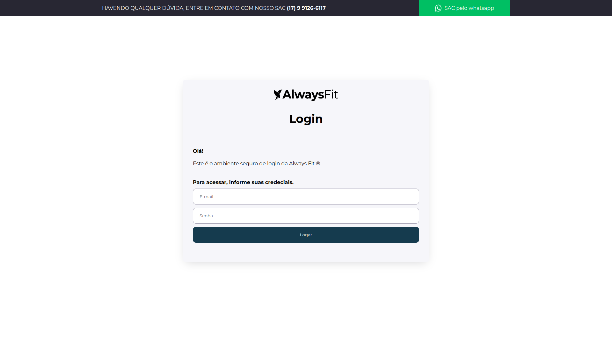
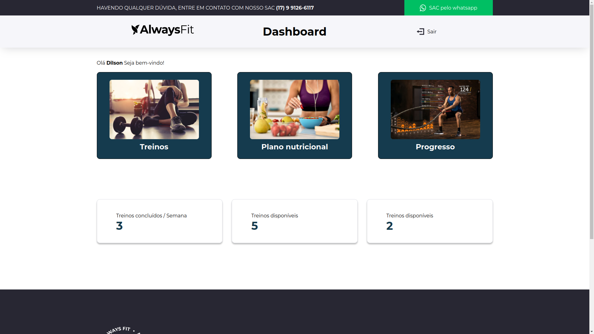
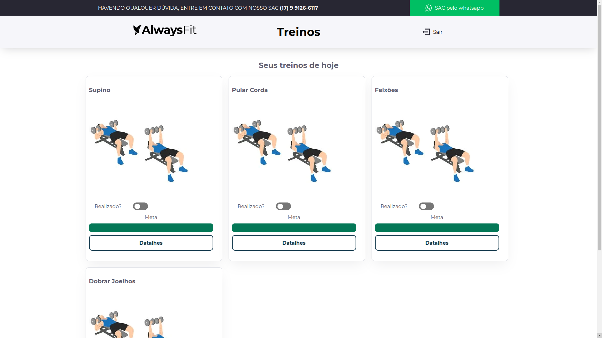

# Painel FIT Back

Front-end que consome a API do painel-fit-back, trata-se de uma aplicação VUE, com autenticação de usuários e gerenciamento de treinos, planos nutricionais e verificação de progresso.

---
## Screenshots







## Funcionalidades

-   Autenticação de Usuários com Sanctum
-   Gerenciamento de Treinos (CRUD)
-   Gerenciamento de planos nutricionais


## 🚀 Tecnologias

- Node 20+
- VUE
- TypeScript
- Axios
- VUE Router

---

## 🛠️ Instalação

> Requisitos: Node instalado

```bash
    git clone https://github.com/dilsoncampelo10/painel-fit-front
    cd painel-fit-front

    npm install
    npm run dev
```


### A fazer:
- [ ] Testes de unidade
- [ ] Tela de planos nutricionais
- [ ] Tela de progresso
- [ ] Tela para cadastros